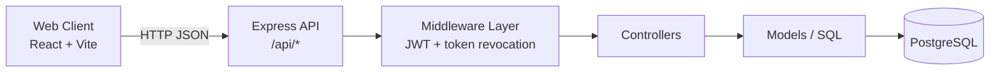
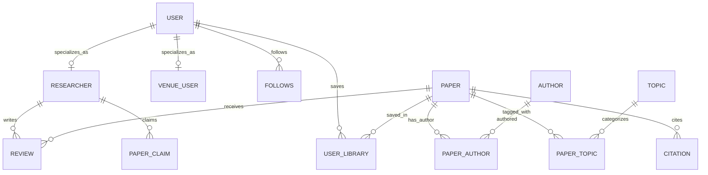

# PaperBoat: LLM-Optimized Technical README

ResearchGate-style academic networking platform implemented in JavaScript with a split frontend/backend architecture.

## Project Signature & Tech Stack

### Core Stack

- Frontend: React 19, React Router, Axios, TailwindCSS, Vite
- Backend: Node.js, Express 5, JWT auth, bcrypt
- Database: PostgreSQL (`pg` driver)
- Realtime foundation: Socket server modules exist (`backend/src/realtime`) but are not currently wired into API flows

### System Shape



### Database Type and Relationship Modeling

- DB type: Relational SQL (PostgreSQL).
- User-publication relations are represented through multiple join pathways depending on intent:
  - Authorship claim path: `user -> researcher(user_id) -> paper_claim(researcher_id, paper_id)`.
  - Library/save path: `user_library(user_id, paper_id)`.
  - Canonical authorship metadata path: `paper_author(paper_id, author_id, position)` and `researcher(author_id)` for user-linked authors.
- Citation graph is directed and normalized in `citation(citing_id, cited_id)`.
- Topic taxonomy is normalized: `domain -> field -> topic`, with paper assignment via `paper_topic`.

## Feature Implementation Status

Feature states:

- Stable: implemented and actively consumed by frontend or complete backend workflow.
- Beta: implemented but partially wired, narrow validation, or role checks are scattered.
- Buggy: known inconsistency/TODOs in code comments or likely behavior edge cases.

| Feature                                         | Mechanism                                                                                                                                       | State  |
| ----------------------------------------------- | ----------------------------------------------------------------------------------------------------------------------------------------------- | ------ |
| User signup/login/logout                        | `POST /api/users`, `POST /api/users/login`, JWT (`7d`) persisted in `user.jwt_token`; bcrypt hashing; Axios interceptor injects `Authorization` | Stable |
| Session revocation                              | Middleware verifies presented JWT and checks it matches stored `user.jwt_token` in DB                                                           | Stable |
| Basic route protection                          | Global auth middleware with explicit public-route matcher (`doesPathMatch`)                                                                     | Stable |
| Role-aware access (researcher-only review/vote) | Controller-level checks (`req.user.role === "researcher"`) in review controller                                                                 | Beta   |
| Researcher account onboarding                   | `POST /api/researchers` creates user + researcher mapping to existing author profile                                                            | Stable |
| Venue-user onboarding                           | `POST /api/venue-users` creates user + venue_user mapping to existing venue                                                                     | Stable |
| Paper CRUD                                      | `paper` table + `/api/papers` CRUD endpoints with pagination and venue joins                                                                    | Stable |
| Paper discovery/search                          | Backend filters by domain/field/topic + title search (`ILIKE`); frontend applies sort in-memory                                                 | Stable |
| Citation tracking                               | Directed citation edges via `citation`; endpoints for add/remove/cited-by/references                                                            | Stable |
| Topic tagging for papers                        | `paper_topic` join table + `/api/papers/:id/topics` endpoints                                                                                   | Beta   |
| Review threads (paper + replies)                | Single `review` table with `(paper_id XOR parent_review_id)` check; recursive CTE for tree                                                      | Stable |
| Review voting                                   | `review_vote` upsert (`ON CONFLICT`) and per-review vote retrieval                                                                              | Stable |
| Follow graph                                    | `follows(following_user_id, followed_user_id)` with anti-self and uniqueness constraints                                                        | Beta   |
| User library/save paper                         | `user_library` join table + user library endpoints                                                                                              | Stable |
| Dashboard analytics (researcher/venue_user)     | Role-based dashboard endpoints: recent papers, top cited, prominent authors                                                                     | Stable |
| Notifications                                   | `notification` + subtype tables (`user_notification`, `paper_notification`, `review_notification`) and receiver table                           | Beta   |
| OpenAlex ingestion                              | Seed scripts and integrity checks in `backend/src/scripts` + env-gated write mode                                                               | Beta   |
| PDF upload pipeline                             | No server-side upload handler; paper stores `pdf_url` only (link-based)                                                                         | Buggy  |

## Data Schema & Flow

### User-Publication-Interaction Triangle



### Feed/Search Logic (Implemented Behavior)

There is no global social feed endpoint yet. The primary discovery flow is in `PapersDiscoveryPage` and resolves in this order:

1. If search query exists: call `GET /api/papers/search?q=<term>`.
2. Else if topic selected: `GET /api/papers/topic/:topicId`.
3. Else if field selected: `GET /api/papers/field/:fieldId`.
4. Else if domain selected: `GET /api/papers/domain/:domainId`.
5. Else fallback: `GET /api/papers`.

Ranking/sorting:

- Backend ordering default: `publication_date DESC NULLS LAST`.
- Frontend secondary sort options: recent, oldest, title A-Z, title Z-A (in-memory over paged results).

Search matching:

- Current matcher is SQL `ILIKE` on `paper.title` only.

## API Architecture

### Primary REST Surface

All endpoints are REST under `/api`.

- Auth/User core: `/api/users/*`
- Papers and graph edges: `/api/papers/*`
- Authors: `/api/authors/*`
- Taxonomy (domain/field/topic): `/api/topics/*`
- Reviews and votes: `/api/reviews/*`
- Researcher workflows: `/api/researchers/*`
- Venue workflows: `/api/venues/*`, `/api/venue-users/*`
- Notifications: `/api/notifications/*`
- Admin workflows: `/api/admin/*`

### High-Signal Endpoints (Operational)

| Action                | Method + Path                                                                                                       | Notes                             |
| --------------------- | ------------------------------------------------------------------------------------------------------------------- | --------------------------------- |
| Login                 | `POST /api/users/login`                                                                                             | Returns `{ token, role, userId }` |
| Register generic user | `POST /api/users`                                                                                                   | Also returns JWT                  |
| Discover papers       | `GET /api/papers`, `/api/papers/search`, `/api/papers/domain/:id`, `/api/papers/field/:id`, `/api/papers/topic/:id` | Paginated                         |
| Read paper detail     | `GET /api/papers/:id`                                                                                               | Includes venue + ordered authors  |
| Create paper          | `POST /api/papers`                                                                                                  | Requires token                    |
| Add citation          | `POST /api/papers/:id/citations`                                                                                    | `id` = citing paper               |
| Paper review tree     | `GET /api/reviews/paper/:paperId/tree`                                                                              | Returns roots + grouped replies   |
| Create review/reply   | `POST /api/reviews`                                                                                                 | Researcher-only                   |
| Cast vote             | `POST /api/reviews/:id/votes`                                                                                       | Upsert semantics                  |

### Critical Payload Contracts

#### 1) Login

`POST /api/users/login`

Request:

```json
{
  "email": "researcher@example.org",
  "password": "plaintext-password"
}
```

Success response:

```json
{
  "token": "<jwt>",
  "role": "researcher",
  "userId": 42
}
```

#### 2) Create publication

`POST /api/papers`

Request:

```json
{
  "title": "Graph Contrastive Learning for Scholarly Networks",
  "publication_date": "2025-11-03",
  "pdf_url": "https://host/paper.pdf",
  "doi": "10.1000/example-doi",
  "is_retracted": false,
  "github_repo": "https://github.com/org/repo",
  "venue_id": 7
}
```

Success response:

```json
{
  "success": true,
  "message": "Paper created successfully.",
  "data": {
    "title": "Graph Contrastive Learning for Scholarly Networks",
    "publication_date": "2025-11-03T00:00:00.000Z",
    "pdf_url": "https://host/paper.pdf",
    "doi": "10.1000/example-doi",
    "is_retracted": false,
    "github_repo": "https://github.com/org/repo",
    "venue_id": 7
  }
}
```

#### 3) Create review or reply

`POST /api/reviews`

Root review request:

```json
{
  "paper_id": 123,
  "text": "Strong methods section, but missing ablation details."
}
```

Reply request:

```json
{
  "parent_review_id": 888,
  "text": "Agree. Reproducibility details are minimal."
}
```

#### 4) Cast vote

`POST /api/reviews/:id/votes`

Request:

```json
{
  "is_upvote": true
}
```

## LLM Shortcuts (Context Injection)

### Shortcut A: Global auth gate + revocation model

- Middleware applies to all routes except `publicRoutes` in server bootstrap.
- JWT verification is not enough: token must match DB-stored `user.jwt_token`.
- Practical implication for tooling/agents: user logout and password change revoke prior tokens server-side.

Pseudo-flow:

```txt
request -> extract Bearer token -> jwt.verify -> load user -> compare token with user.jwt_token -> allow/deny
```

### Shortcut B: Discovery endpoint selection logic

- The UI does not call all filters simultaneously.
- Endpoint is selected by strict precedence (search > topic > field > domain > all papers).
- Frontend sorting is post-fetch, local to current page payload.

### Shortcut C: Review tree contract

- `GET /api/reviews/paper/:paperId/tree` returns:
  - `roots`: top-level reviews
  - `repliesByReview`: map keyed by parent review id
- Client recursively renders from this map; this is not a nested JSON tree from server.

### Shortcut D: RBAC is controller-local

- There is no centralized role middleware (for example `requireRole("researcher")`).
- Role checks currently appear directly inside handlers (notably review and vote flows).

## Constraint Log (Technical Debt / Missing Features)

1. Search quality is limited: title-only `ILIKE`; no full-text ranking, no fuzzy matching, no semantic/vector retrieval.
2. No first-class publication file upload: only `pdf_url` string is stored; no Multer/S3/Cloudinary upload pipeline wired for papers.
3. RBAC is not uniformly centralized; role enforcement is scattered across controllers.
4. In-memory login rate limiter (`Map`) is single-process and resets on restart; not suitable for horizontal scaling.
5. Frontend sort is in-memory after paginated fetch, so global ordering across full result set is approximate.
6. API response envelopes are inconsistent (`{success,data}` vs raw arrays/objects across some controllers).
7. Realtime modules exist but are not integrated into notification/review/live feed workflows yet.
8. Automated test suites are not present in repo scripts (`npm test` placeholder only on backend).
9. Comments/TODOs in paper topic logic indicate naming inconsistency and pending cleanup.
10. No GraphQL layer; all data access is REST with route-specific payload contracts.

## Repository Structure (High-Level)

```txt
PaperBoat/
	frontend/
		src/
			api/axios.js
			context/AuthContext.jsx
			pages/
				PapersDiscoveryPage.jsx
				PaperDetailsPage.jsx
				PaperReviewsPage.jsx
				DashboardPage.jsx
			routes/ProtectedRoute.jsx
	backend/
		src/
			index.js
			middlewares/authenticateToken.js
			controllers/
			models/
			routes/
			database/
				schema.sql
				functions.sql
				procedures.sql
				triggers.sql
			scripts/
				seedOpenAlex.js
				seedIntegrityChecks.js
```

## Runtime Notes

- Default API URL expected by frontend Axios client: `http://localhost:3000/api`.
- JWT secret and DB connection are required in backend env.
- Public API endpoints include login/signup and discovery lookups; most write paths require auth.
- If `BYPASS=true`, backend auth middleware is skipped (development-only mode).
